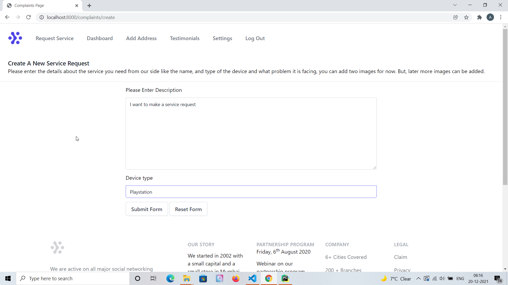
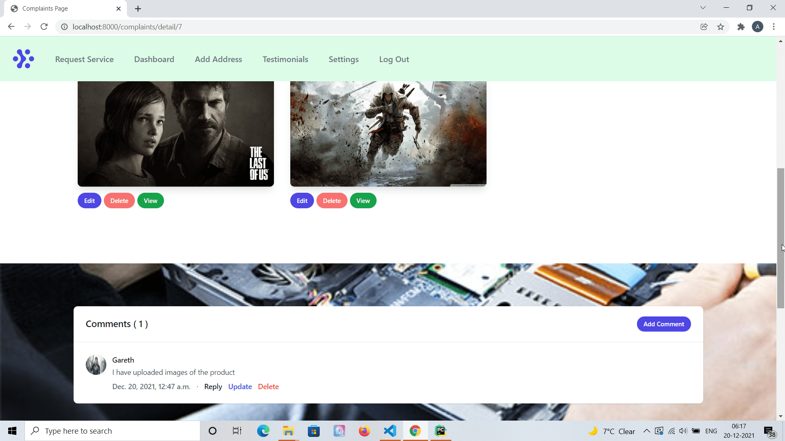
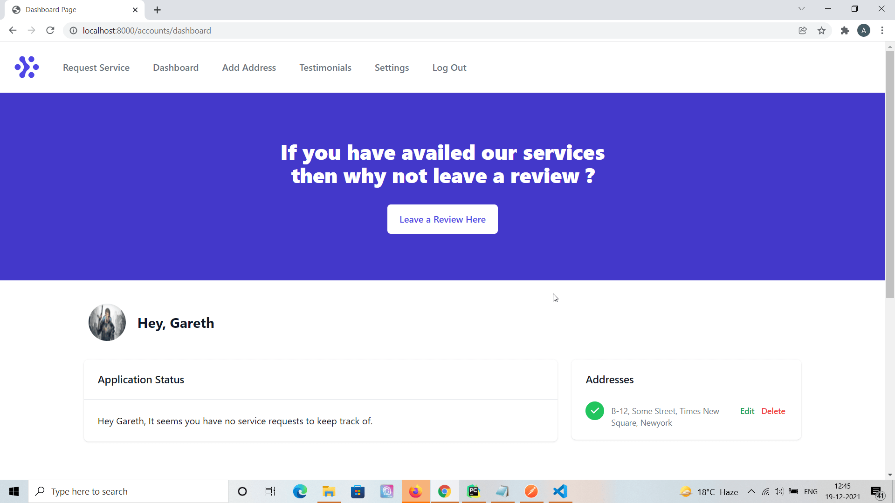
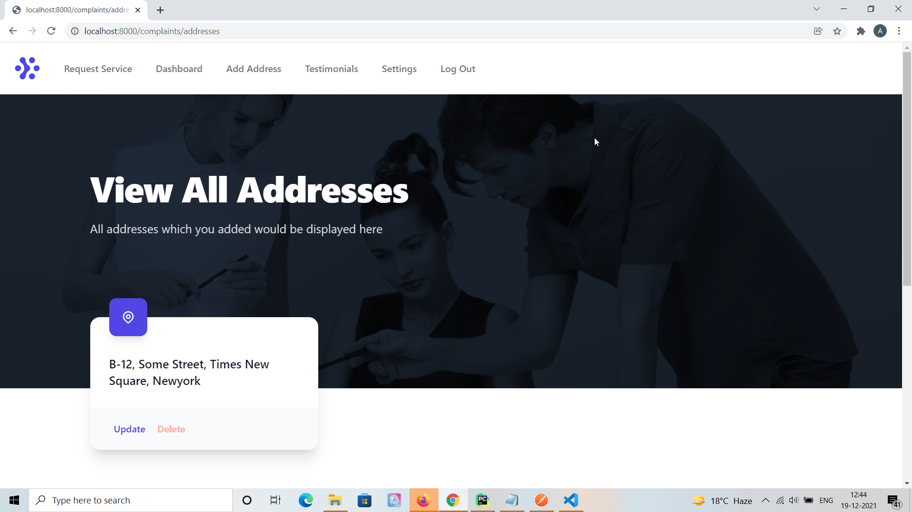

# A Web Application for a imaginary company called 'Digifix' which facilitates door to door repairing of your gadgets through online portal.

'Digifix' has an online portal where you can register and ask for a service request mentioning the type of gadget you have in possession which requires to be serviced. You can upload images of the same while registering service request.

When you request would be opened by admins, they'd assign you a reference ID and would assign a suitable engineer according to the type of problem and the device you have. Digifix would sent people at your doorstep to pick up the device. Though this reference ID you can keep track of your service request and how long would it take. A thread would be opened where you can contact with the engineer assigned to your task, post comments and pictures. After it's done and the product is returned to you, you can write a review of the service provided as 'testimonial'. Other auxiliary features like updating your account settings are provided.

This project uses custom authentication system in Django made by extending base user class. It has full CRUD functionality on user testimonials and multiple addresses which can be added for correspondence.

This project now uses Tailwind CSS.

## Getting Started

* Create a new virtual environment and install packages specified in the requirements.txt file.

* Hook in your database of choice, make necessary database changes in the settings.py file inside the project folder. Obviously, some familiarity with Django folder structures is required for this. By default this project uses MySQL as database.

* Make migrations when you're done with the database settings and migrate.
* Run python manage.py runserver, and the application should be running on port 8000 by default.

* Please find the screenshots of the application attached below.

## Built With

* [Python Django](https://www.djangoproject.com/)
* [Django Rest Framework](https://www.django-rest-framework.org/)
* [Tailwind CSS](https://tailwindcss.com/)

## API

Until recently it was a stand-alone back-end application created purely in Django with views written in 
Django using the DTL (Django Templating Language). I've recently written APIS for it using DRF 
(Django Rest Framework). Having API would allow it to seamlessly connect to a stand-alone front end app written
in Vue/React/Angular.

There is a separate app which exists only for API end-points. While planning APIs for an existing Django
app, there could have been multiple approaches. One other popular approach could have been 
to have separate APIs for each of the existing application within Django app. Each app would 
have their own separate serializer, permission and views file which is pretty suitable for larger app.
But, here I have used a single API app which houses permissions, urls, serializers and views for all the applications 
within this Django app.

Online documentation for the API is created using Postman [here](https://documenter.getpostman.com/view/7768616/UVRAJ7Rz)

## Authors

* **Amit Prafulla (APFirebolt)** - (http://apgiiit.com/)

## License

This project is licensed under the MIT License - see the [LICENSE.md](LICENSE.md) file for details

## Screenshots

Recently, Tailwind CSS and Tailwind components are added to this project which replaced custom CSS
written on top of Bootstrap. As a result of it, entire UI is changed so I had to reupload
screenshots for this project which you can find below.

Screenshot of posting a service request.

Service Request detail page which shows images and comments which can be added to a service request.

Dashboard page screenshot.

As a review for the service received, users can also add testimonials which other 
users would be able to see. Below is the screenshot for this page.

Users can add multiple addresses to their account. Below shows screenshot of the 
address list page which would display all the addresses of the logged in user.

More screenshots might be added in the future.